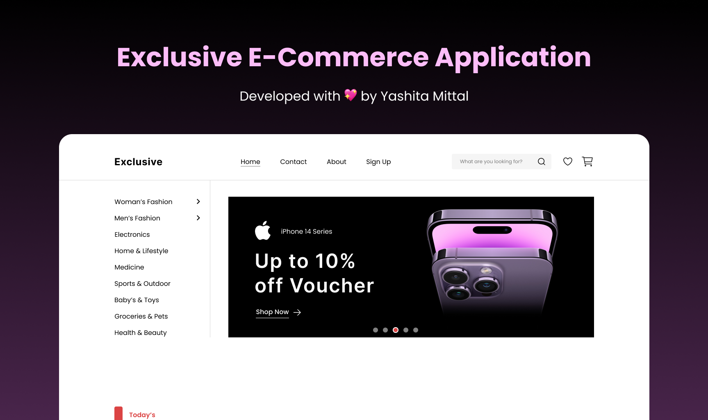

<div align="center">
  <p>An eCommerce application crafted with <strong>Next.js</strong> and <strong>TypeScript</strong>, focusing on modern architecture, performance, and seamless user experience. This project is built to handle the complexities of an online shopping platform while maintaining a clean, maintainable codebase that’s ready for future growth.
</p>
  
  
  
  
</div>


## 🔥 Why Select this Project?

- **Latest Next.js Features**: Uses cutting-edge features like Partial Pre-rendering and the Metadata API, ensuring fast load times and SEO optimization.
- **Modular, Clean Architecture**: Designed with component-based architecture and **SOLID principles** to ensure scalability and easy maintenance.
- **Comprehensive Accessibility**: Built with full accessibility compliance, ensuring inclusivity for all users, regardless of ability.
- **Enhanced Security with AuthJS**: Secure user authentication implemented with AuthJS, providing robust, tested, and scalable authentication functionality.
- **Thoroughly Optimized**: Every aspect, from OpenGraph metadata to responsiveness on all devices, has been set up with precision.
- **Component-Driven Development**: Reusable components allow for a flexible, maintainable codebase, enabling rapid iteration and easy feature expansion.

## 🛠️ Tech Stack

- **Frontend**: [Next.js](https://nextjs.org/) with **TypeScript**
- **Styling**: CSS Modules and **Tailwind CSS** for clean and consistent design
- **Backend**: Integration with the [Fake Store API](https://fakestoreapi.com/) as a Placeholder Backend Service
- **Authentication**: **AuthJS** for secure, reliable user sessions

## 📐 Architecture and Principles

This project is organized with a **component-based, modular structure** that aligns with **SOLID principles**. The emphasis is on clean, maintainable code with reusability and scalability in mind. Each component is designed for maximum flexibility, making it easy to adapt the app to evolving business needs.

## 💡 Features

- **Fully Responsive**: Optimized for mobile, tablet, and desktop, providing a seamless experience across devices.
- **SEO and Social Metadata**: Using the Next.js Metadata API, OpenGraph images, and enriched metadata, the app is optimized for visibility and social sharing.
- **Product Browsing**: Users can search and filter products across categories, making it easy to find what they need.
- **Detailed Product Views**: Products are displayed with images, descriptions, and specifications to help users make informed choices.
- **Secure User Authentication**: Powered by **AuthJS**, providing a robust, out-of-the-box authentication solution with session management.
- **Shopping Cart**: Add, remove, and update products in the cart with ease.
- **Streamlined Checkout Process**: A clean, intuitive multi-step checkout flow to minimize friction.
- **Order Management**: Users can track order statuses and view order history.

## 🔧 Installation

To set up the project locally:

1. **Clone the repository:**
   ```bash
   git clone https://github.com/YashitaCodes/exclusive-ecommerce.git
   cd exclusive-ecommerce
   ```

2. **Install dependencies:**
   ```bash
   npm install
   ```

3. **Set up environment variables:**
   - Create a `.env.local` file in the root directory.
   - Add variables for AuthJS, API keys, and other necessary configurations.

4. **Start the development server:**
   ```bash
   npm run dev
   ```

5. Open [http://localhost:3000](http://localhost:3000) to explore the app.

## 🎨 Original Design and Requirements

The design and functional requirements for this project were listed by Peritys and InteractsAI in the Figma file and the final website design was a pixel-by-pixel replication of that file. [View the original Figma requirements here](https://www.figma.com/design/bDCwDZYhh9zvhZOG4L26ui/Full-E-Commerce-Website-UI-UX-Design-(Community)?node-id=1-3&node-type=canvas&t=y3MfIKEaplHiejF5-0).

## 📝 License

This project is licensed under the MIT License. See the [LICENSE](LICENSE.md) file for details.
